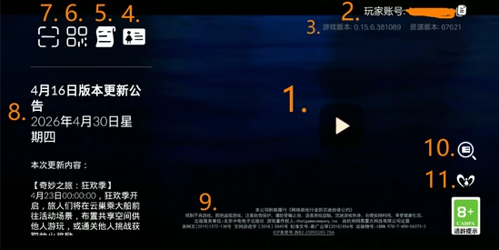
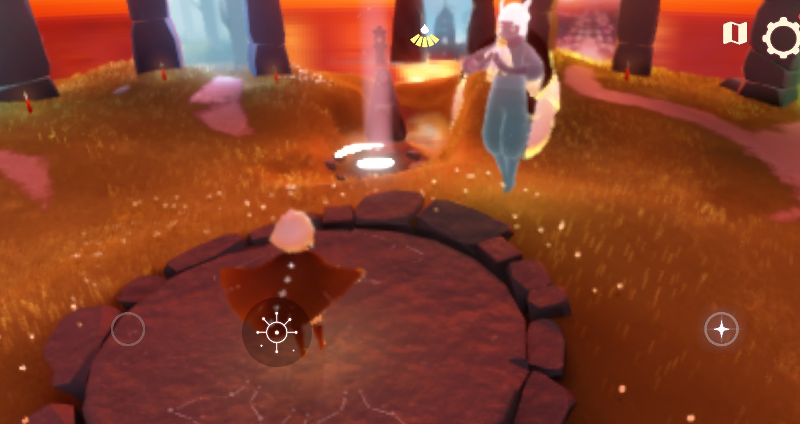

本页汇总《光·遇》的常用操作方法、技巧与设置建议。
# 启动与开始
启动《光·遇》，在[TGC](https://thatgamecompany.com/)徽标和[网易](https://www.163.com)徽标后，你将看到账号加载界面，如果你**没有登录过任何账号**或**已登录账号不可用**（通常是由于验证过期），你将看到**登录界面**。  
如果程序缓存了可用的账号，那么程序会尝试自动登录**最近一次成功**登录的账号。  
账号登录成功后，你将看到**启动页面**。  
以下带有标记的启动页面有助于你了解其功能：  
  
同时，以下表格用于解释图片标记。  

| 序号 | 描述 |
| --- | --- |
| 1 | 进入游戏图标。 |
| 2 | 玩家账号代码。（这属于隐私内容） |
| 3 | 游戏版本号和资源编号。 |
| 4 | 账号中心。 |
| 5 | 用户与隐私协议（服务条款）。 |
| 6 | 链接到官方中国光遇网站的二维码。 |
| 7 | 二维码扫描器。 |
| 8 | 游戏内更新公告，从上到下分为三段：版本更新时间、当前日期、版本更新内容。 |
| 9 | 出版信息。 |
| 10 | 自助找回游戏账号的链接，此链接实时生成，必须在游戏内打开。 |
| 11 | 指向“网易家长关怀平台”的链接，可视为关于未成年人保护的常见问题页面。 |

单击**进入游戏图标**，你将看到一段加载动画，底部进度条指示加载进度  
  
加载完成后，界面呈现类似下图  
  
